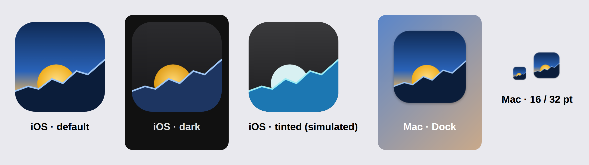

# App icon

A sun setting behind a rising chart: retirement, and the money that gets you there. The palette is the app's (the
blue ramp of the projection fan, ink, and the gold of the gold asset class).

| File | What it is |
| --- | --- |
| `AppIcon.svg` | iPhone and iPad, default appearance: full bleed, the system rounds the corners |
| `AppIcon-Dark.svg` | Dark appearance (iOS 18+): no background, the system draws one |
| `AppIcon-Tinted.svg` | Tinted appearance: grayscale on no background, the system tints it by brightness |
| `AppIcon-Mac.svg` | Mac: the same artwork in Apple's macOS template, an 824 pt rounded square with a shadow on the 1024 canvas |

To change the icon, edit the SVGs, then regenerate `App/Resources/Assets.xcassets/AppIcon.appiconset`:

```sh
cd App/Design/AppIcon
node render.mjs      # needs Playwright: npm i -g playwright && npx playwright install chromium
python3 build.py     # needs Pillow: pip3 install pillow
```

This folder isn't part of the app target; only the asset catalog is.


